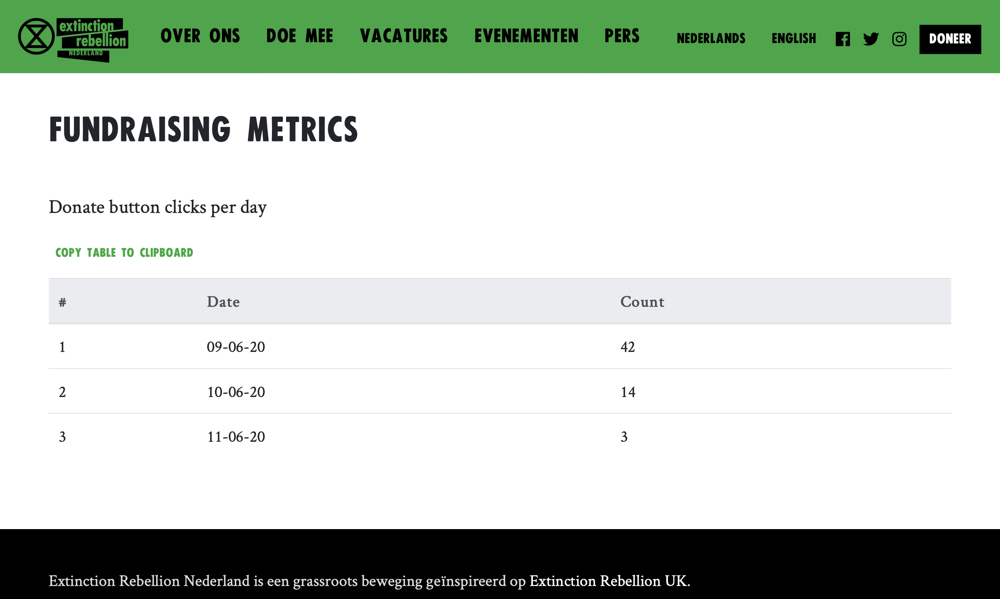

# XRNL Fundraising plugin

#### This plugin does 3 things:
- Adds a per-day counter of requests for the `/donate` page in `post_meta` data
- Provides a shortcode which outputs table rows with the per-day counts
- Redirects to the URL specified in the `get_redirect_url` function

#### To use:
1. Install and activate the plugin
2. Turn off the current `.htaccess` redirect
3. Create a page, e.g. extinctionrebellion.nl/fundraising, and paste in something like this:

```html
<h4>Donate button clicks per day</h4>
<table class="table">
  <thead class="thead-light">
    <tr>
      <th scope="col">#</th>
      <th scope="col">Date</th>
      <th scope="col">Count</th>
    </tr>
  </thead>
  <tbody>
    [xrnl-fundraising]
  </tbody>
</table>
```

4. Add some javascript for easy copying to a spreadsheet  

```html
<script src="https://unpkg.com/clipboard@2/dist/clipboard.min.js"></script>
<script>new ClipboardJS('.btn');</script>
<button class="btn" data-clipboard-target=".table">
    Copy table to clipboard
</button>
```

##### Screenshot:

